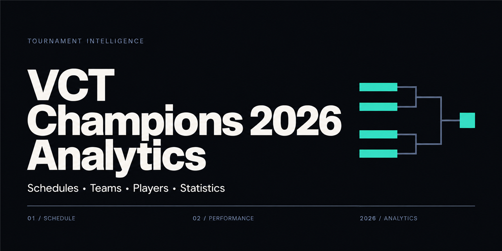

# VCT Champions 2026 Analytics



A web application for exploring VCT Champions 2026 schedules, teams, players, rankings, and match trends. Liquipedia is the canonical schedule source. Verified match statistics come from the VCT Reference DuckDB snapshot, and MongoDB stores application data.

## Features

- Event overview, schedule, and stage filters
- Team and player rankings, profiles, and search
- Match and map statistics with trend charts
- Manual data updates from Settings and saved import status

## Architecture

```text
Browser
  │ same-origin /api requests
  ▼
Web server 0.0.0.0:5577
  ├─ serves frontend/dist/
  └─ proxies /api/* to 127.0.0.1:8591
                         │
                         ▼
                    API service
                      ├─ MongoDB
                      ├─ Liquipedia API
                      └─ VCT Reference DuckDB snapshot
```

In production, the web server serves the built files from `frontend/dist/` and proxies same-origin `/api/*` requests to the API service. The API service stays bound to `127.0.0.1:8591`; LAN devices connect to port `5577` only. Vite development also uses port `5577`, bound to `127.0.0.1`.

The [web application guide](frontend/README.md) covers Bun scripts and LAN access. The [API service guide](backend/README.md) describes data setup, updates, and runtime storage.

## Repository layout

```text
├── backend/                 FastAPI API service and data import flows
├── frontend/                React application, Vite configuration, and production web server
├── LICENSE                  Apache License 2.0
├── NOTICE
├── README.md
└── THIRD_PARTY_NOTICES.md   Data, media, trademark, and dependency notices
```

## Requirements

- Python 3.13 and Conda
- Bun and Node.js 20.19+ or 22.12+; Node.js is required by the Vite toolchain and `frontend/server.mjs`
- A reachable MongoDB instance
- Network access to Liquipedia and VCT Reference for live data updates

Install Bun using the [official installation guide](https://bun.sh/docs/installation).

## First setup

From the repository root, prepare the API service environment in a Terminal:

```bash
cd backend
conda env create -f environment.yml
conda activate VCT-Analytics
python -m pip install -e .
cp .env.example .env
```

If the `VCT-Analytics` environment already exists, activate it and install the package without creating the environment again. Edit `backend/.env` with the MongoDB connection and database name. Live Liquipedia requests also require `LIQUIPEDIA_USER_AGENT` to identify VCT Analytics and include a contact address you control. Do not commit `.env`.

Install web application dependencies and create the production files from a Terminal at the repository root:

```bash
cd frontend
bun install
bun run typecheck
bun run build
```

## Run the application

Start MongoDB separately. In one Terminal, start the API service:

```bash
cd backend
conda activate VCT-Analytics
python manage.py start
```

In another Terminal, start the production web server:

```bash
cd frontend
bun run serve
```

The local web application is at `http://127.0.0.1:5577`. Manage the web server and API service separately; the API service also has explicit lifecycle commands. See the subdirectory guides for details. A first import can be run with the one-time update workflow documented in the API service guide. The recurring scheduler is disabled by default.

## Data sources and runtime files

Liquipedia supplies the canonical schedule. The data service uses VCT Reference snapshot data for verified match statistics, then stores application records in MongoDB. Settings can start a manual update. The recurring scheduler is a separate process and remains disabled unless enabled in `.env`.

The DuckDB snapshot is stored at `backend/var/data/vct-reference/vct.duckdb`. Runtime cache, reports, logs, process locks, metadata, temporary files, and backups live under `backend/var/`. Keep those files, `.env`, and MongoDB dumps out of commits. Team logos are maintained separately under `backend/var/assets/team-logos/`; player portraits are outside the project scope.

## License and third-party material

The Apache License 2.0 covers original source code and original project documentation. It does not cover external datasets, team logos, media, or trademarks. See [LICENSE](LICENSE), [NOTICE](NOTICE), and [THIRD_PARTY_NOTICES.md](THIRD_PARTY_NOTICES.md).

Liquipedia text requires attribution and compliance with its CC BY-SA 3.0 terms; images and other media may have separate terms. The VCT Reference dataset is governed by its [dataset page](https://vct-reference.com/dataset) and [Terms of Service](https://vct-reference.com/terms). Riot Games and team marks remain with their respective rights holders. This project is not affiliated with or endorsed by Riot Games.
